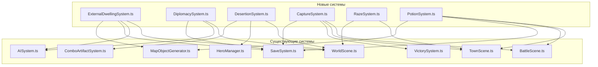

# 🎯 План развития — Канонические механики HoMM IV
## Версия 2.5.0 — "Канон"

**Дата:** 2026-06-11
**Исходная версия:** 2.4.0 (90% готовности)
**Правило:** Не трогаем визуал и звук

---

## 📊 Обзор: 8 новых механик

```
┌──────────────────────────────────────────────────────┐
│ 1. 🏚️ Внешние жилища (External Dwellings)            │
│ 2. 🤝 Дипломатия с ИИ                                │
│ 3. 🏃 Эмиграция существ (дезертирство)               │
│ 4. 🏳️ Сдача в плен / побег героя                     │
│ 5. 💥 Разрушение города                               │
│ 6. 🧪 Зелья и расходники                              │
│ 7. 📈 Банк существ в жилищах                          │
│ 8. ⬆️ Улучшение внешних жилищ                         │
└──────────────────────────────────────────────────────┘
```

---

## 1. 🏚️ Внешние жилища существ (External Dwellings)

### Канон HoMM IV
Внешние жилища — это здания на карте, которые:
- Дают еженедельный прирост существ определённого типа
- Накапливают существ (банк), если их не нанимают
- Имеют флаг владельца (player/ai/neutral)
- Можно улучшить (как городские жилища)
- Можно нанимать существ прямо на карте

### Текущее состояние
Сейчас в `MapObjectGenerator` есть 6 «жилищ» (тип `refugee_camp`), но они работают как одноразовые лагеря беженцев — просто дают существ при посещении и исчезают.

### Что нужно сделать

#### 1a. Новый тип объекта `dwelling` в `types.ts`
```typescript
// Добавить в MapObjectType:
| 'dwelling'

// Новый интерфейс:
interface DwellingData {
  dwellingId: string;        // ID жилища (напр. 'wolf_pen')
  dwellingName: string;      // Название (напр. 'Волчье логово')
  creatureId: string;        // ID существа для найма
  creatureName: string;      // Название существа
  faction: FactionId;        // Фракция жилища
  tier: number;              // Тир существа (1-7)
  baseGrowth: number;        // Базовый прирост в неделю
  bankedCreatures: number;   // Накоплено существ (банк)
  owner: OwnerType;          // Владелец
  isUpgraded: boolean;       // Улучшено ли жилище
  upgradedCreatureId?: string; // ID улучшенного существа
  lastGrowthDay: number;     // Последний день прироста
}
```

#### 1b. Новая система `ExternalDwellingSystem.ts` (~350 строк)
- `createDwelling(config)` — создание жилища
- `applyWeeklyGrowth()` — еженедельный прирост для всех жилищ игрока
- `hireFromDwelling(hero, dwellingId, count)` — найм существ из жилища
- `captureDwelling(dwellingId, newOwner)` — захват жилища
- `upgradeDwelling(dwellingId)` — улучшение жилища
- `getDwellingInfo(dwellingId)` — информация о жилище
- `canHireFromDwelling(hero, dwellingId)` — проверка возможности найма
- `serialize() / deserialize()` — для SaveSystem

#### 1c. Обновление `MapObjectGenerator.ts`
- Заменить 6 `refugee_camp` на полноценные `dwelling` объекты
- Добавить 12-15 жилищ разных фракций и тиров
- Распределить по карте (near/medium/far)

#### 1d. Обновление `WorldScene.ts`
- Обработчик взаимодействия с жилищем (вместо `visitRefugeeCamp`)
- Показать UI с информацией о жилище и возможностью найма
- Обновление флагов владельца при захвате
- Интеграция с `applyWeeklyGrowth()` — добавить прирост из внешних жилищ

#### 1e. Обновление `SaveSystem.ts`
- Сохранение/загрузка данных о внешних жилищах

#### 1f. Обновление `AISystem.ts`
- ИИ может захватывать внешние жилища
- ИИ нанимает существ из жилищ
- Приоритет: CAPTURE_DWELLING = 85

### Файлы:
| Действие | Файл | Описание |
|----------|------|----------|
| ✨ Создать | `src/systems/ExternalDwellingSystem.ts` | Ядро системы (~350 строк) |
| 🔧 Обновить | `src/types.ts` | Тип `dwelling`, `DwellingData` |
| 🔧 Обновить | `src/systems/MapObjectGenerator.ts` | Генерация 12-15 жилищ |
| 🔧 Обновить | `src/scenes/WorldScene.ts` | Взаимодействие, прирост, UI |
| 🔧 Обновить | `src/systems/SaveSystem.ts` | Сохранение/загрузка |
| 🔧 Обновить | `src/systems/AISystem.ts` | ИИ взаимодействие |

---

## 2. 🤝 Дипломатия с ИИ

### Канон HoMM IV
- Отношения: война (по умолчанию), перемирие, союз
- Возможность предложить перемирие/союз
- Обмен ресурсами через дипломатию
- Ультиматумы (отдать ресурсы или война)
- Репутация влияет на отношение

### Текущее состояние
Дипломатия есть только как навык героя для neutral существ. ИИ всегда враждебен.

### Что нужно сделать

#### 2a. Новая система `DiplomacySystem.ts` (~400 строк)
```typescript
type DiplomaticStatus = 'war' | 'truce' | 'alliance';

interface DiplomaticRelation {
  playerId: string;
  aiId: string;
  status: DiplomaticStatus;
  reputation: number;        // -100 до +100
  turnsRemaining: number;    // Осталось ходов (для перемирия)
  lastAction: string;        // Последнее действие
  history: string[];         // История отношений
}

// Методы:
- getRelation(aiId): DiplomaticRelation
- proposeTruce(aiId, offer?: Resources): boolean
- proposeAlliance(aiId, offer?: Resources): boolean
- breakTruce(aiId): void
- declareWar(aiId): void
- tradeResources(aiId, give: Resources, receive: Resources): boolean
- sendUltimatum(aiId, demand: Resources, message: string): void
- updateReputation(aiId, delta: number): void
- onAIAction(aiId, action: string): void  // Реакция на действия ИИ
- aiEvaluateDiplomacy(aiId): void  // ИИ принимает дип. решения
```

#### 2b. UI дипломатии `DiplomacyUI.ts` (~250 строк)
- Окно дипломатии (вызывается по кнопке или горячей клавише)
- Список ИИ-противников с текущим статусом
- Кнопки: предложить перемирие, предложить союз, объявить войну
- Окно торговли (обмен ресурсами)
- Окно ультиматума

#### 2c. Обновление `AISystem.ts`
- ИИ учитывает дипломатический статус при генерации целей
- Если перемирие — не атакует игрока
- Если союз — может помогать (не атакует шахты игрока)
- ИИ может предлагать перемирие если слабее
- ИИ может разрывать перемирие если стал сильнее

#### 2d. Обновление `WorldScene.ts`
- Горячая клавиша `D` для дипломатии
- Проверка дип. статуса перед атакой ИИ
- Уведомления о дип. событиях

### Файлы:
| Действие | Файл | Описание |
|----------|------|----------|
| ✨ Создать | `src/systems/DiplomacySystem.ts` | Ядро дипломатии (~400 строк) |
| ✨ Создать | `src/ui/DiplomacyUI.ts` | UI дипломатии (~250 строк) |
| 🔧 Обновить | `src/systems/AISystem.ts` | ИИ дипломатия |
| 🔧 Обновить | `src/scenes/WorldScene.ts` | Интеграция, горячие клавиши |
| 🔧 Обновить | `src/systems/SaveSystem.ts` | Сохранение дип. отношений |

---

## 3. 🏃 Эмиграция существ (дезертирство)

### Канон HoMM IV
- При отрицательной морали существа могут покинуть армию
- Смешение фракций даёт штраф к морали (-1 за каждую фракцию сверх 2)
- Предупреждения о возможном дезертирстве
- Ангельский Альянс отменяет штраф фракций

### Текущее состояние
Мораль существует и работает в бою, но дезертирства нет. Штраф за смешение фракций не применяется.

### Что нужно сделать

#### 3a. Новая система `DesertionSystem.ts` (~250 строк)
```typescript
// Методы:
- calculateFactionPenalty(army: ArmySlot[]): number
- calculateDesertionChance(hero: Hero): number
- checkDesertion(hero: Hero): DesertionResult
- applyDesertion(hero: Hero): void
- getDesertionWarning(hero: Hero): string | null
- hasAngelicAlliance(hero: Hero): boolean
```

#### 3b. Обновление `WorldScene.ts`
- Проверка дезертирства в `endTurn()` (каждый ход)
- Предупреждение при низкой морали
- Уведомление о дезертирстве

#### 3c. Обновление `HeroManager.ts`
- Расчёт штрафа за смешение фракций
- Обновление `getMoraleBreakdown()` с учётом фракционного штрафа

### Файлы:
| Действие | Файл | Описание |
|----------|------|----------|
| ✨ Создать | `src/systems/DesertionSystem.ts` | Ядро дезертирства (~250 строк) |
| 🔧 Обновить | `src/scenes/WorldScene.ts` | Проверка в endTurn |
| 🔧 Обновить | `src/systems/HeroManager.ts` | Штраф фракций |
| 🔧 Обновить | `src/systems/ComboArtifactSystem.ts` | Ангельский Альянс |

---

## 4. 🏳️ Сдача в плен / побег героя

### Канон HoMM IV
- При поражении герой не умирает, а сдаётся в плен
- Выкуп героя из плена за ресурсы
- Герой может сбежать и появиться в таверне
- При побеге герой теряет армию, но сохраняет навыки и опыт

### Текущее состояние
При поражении герой умирает (игра заканчивается если это последний герой).

### Что нужно сделать

#### 4a. Новая система `CaptureSystem.ts` (~300 строк)
```typescript
interface CapturedHero {
  hero: Hero;
  capturedBy: string;       // ID ИИ, который захватил
  captureDay: number;       // День захвата
  ransomCost: Resources;    // Стоимость выкупа
  escapeChance: number;     // Шанс побега (растёт со временем)
}

// Методы:
- captureHero(hero: Hero, captorId: string): void
- ransomHero(heroId: string): boolean
- tryEscape(heroId: string): boolean
- getCapturedHeroes(): CapturedHero[]
- getRansomCost(hero: Hero): Resources
- onNewWeek(): void  // Проверка побегов
```

#### 4b. Обновление `BattleScene.ts`
- При поражении вместо смерти — захват героя
- Опция «Сдаться» уже есть, но нужно добавить логику плена

#### 4c. Обновление `TownScene.ts` (таверна)
- Сбежавшие герои появляются в таверне
- Возможность выкупить героя через таверну

#### 4d. Обновление `VictorySystem.ts`
- Условие поражения: все герои в плену И все города потеряны

### Файлы:
| Действие | Файл | Описание |
|----------|------|----------|
| ✨ Создать | `src/systems/CaptureSystem.ts` | Ядро плена (~300 строк) |
| 🔧 Обновить | `src/scenes/BattleScene.ts` | Логика плена при поражении |
| 🔧 Обновить | `src/scenes/TownScene.ts` | Выкуп/побег в таверне |
| 🔧 Обновить | `src/systems/VictorySystem.ts` | Условия поражения |
| 🔧 Обновить | `src/systems/SaveSystem.ts` | Сохранение пленных |

---

## 5. 💥 Разрушение города

### Канон HoMM IV
- Возможность разрушить захваченный вражеский город
- Получение части ресурсов обратно (25-50% от стоимости зданий)
- Нельзя разрушить последний город
- Разрушение происходит мгновенно

### Текущее состояние
Не реализовано.

### Что нужно сделать

#### 5a. Новая система `RazeSystem.ts` (~150 строк)
```typescript
// Методы:
- canRazeTown(townId: string): boolean
- calculateRazeReward(town: TownOwnership): Resources
- razeTown(townId: string): RazeResult
- getRazeWarning(townId: string): string
```

#### 5b. Обновление `TownScene.ts`
- Кнопка «Разрушить город» (красная, с подтверждением)
- Показ награды за разрушение
- Диалог подтверждения

#### 5c. Обновление `WorldScene.ts`
- Удаление города с карты после разрушения
- Обновление условий победы

### Файлы:
| Действие | Файл | Описание |
|----------|------|----------|
| ✨ Создать | `src/systems/RazeSystem.ts` | Ядро разрушения (~150 строк) |
| 🔧 Обновить | `src/scenes/TownScene.ts` | Кнопка и UI |
| 🔧 Обновить | `src/scenes/WorldScene.ts` | Удаление с карты |

---

## 6. 🧪 Зелья и расходники

### Канон HoMM IV
- Зелья лечения, маны, усиления
- Покупка в городе (алхимическая лаборатория)
- Находки на карте
- Использование в бою (тратит действие)

### Текущее состояние
Не реализовано.

### Что нужно сделать

#### 6a. Новые типы в `types.ts`
```typescript
interface Potion {
  id: string;
  name: string;
  description: string;
  effect: PotionEffect;
  cost: Partial<Resources>;
  rarity: 'common' | 'uncommon' | 'rare';
  usableIn: 'battle' | 'map' | 'both';
}

type PotionEffect =
  | { type: 'heal'; amount: number }
  | { type: 'restore_mana'; amount: number }
  | { type: 'boost_stat'; stat: string; amount: number; duration: number }
  | { type: 'resurrect'; percent: number }
  | { type: 'cure' };
```

#### 6b. Новая система `PotionSystem.ts` (~250 строк)
```typescript
// Методы:
- getAvailablePotions(townBuildings: string[]): Potion[]
- buyPotion(hero: Hero, potionId: string): boolean
- usePotionInBattle(hero: Hero, potionId: string, target?: BattleUnit): PotionResult
- usePotionOnMap(hero: Hero, potionId: string): PotionResult
- generateRandomPotion(rarity?: string): Potion
```

#### 6c. Обновление `TownScene.ts`
- Вкладка «Алхимик» (требует здание алхимической лаборатории)
- Покупка зелий

#### 6d. Обновление `BattleScene.ts`
- Кнопка «Зелья» в бою (горячая клавиша `P`)
- Использование зелья тратит действие

#### 6e. Обновление `MapObjectGenerator.ts`
- Добавить зелья как объекты на карте (3-5 штук)

### Файлы:
| Действие | Файл | Описание |
|----------|------|----------|
| ✨ Создать | `src/systems/PotionSystem.ts` | Ядро зелий (~250 строк) |
| 🔧 Обновить | `src/types.ts` | Типы `Potion`, `PotionEffect` |
| 🔧 Обновить | `src/scenes/TownScene.ts` | Вкладка алхимика |
| 🔧 Обновить | `src/scenes/BattleScene.ts` | Использование в бою |
| 🔧 Обновить | `src/systems/MapObjectGenerator.ts` | Зелья на карте |
| 🔧 Обновить | `src/systems/SaveSystem.ts` | Сохранение зелий |

---

## 7. 📈 Банк существ во внешних жилищах

### Канон HoMM IV
- Существа накапливаются если их не нанимают
- Максимальный лимит накопления (обычно 4 недели)
- Еженедельный прирост добавляется к банку

### Текущее состояние
Не реализовано (жилища одноразовые).

### Что нужно сделать

#### 7a. Дополнение `ExternalDwellingSystem.ts`
- Поле `bankedCreatures` в данных жилища
- `addWeeklyGrowth()` — добавляет прирост в банк
- `getMaxBank(creatureId)` — максимальный размер банка
- Отображение количества накопленных существ на карте (число над жилищем)

#### 7b. Обновление `WorldScene.ts`
- Отображение числа накопленных существ над жилищем
- Обновление числа при наведении

### Файлы:
| Действие | Файл | Описание |
|----------|------|----------|
| 🔧 Обновить | `src/systems/ExternalDwellingSystem.ts` | Банк существ |
| 🔧 Обновить | `src/scenes/WorldScene.ts` | Отображение банка |

---

## 8. ⬆️ Улучшение внешних жилищ

### Канон HoMM IV
- Возможность улучшить внешнее жилище (как здание в городе)
- Улучшенное жилище даёт улучшенных существ
- Стоимость улучшения ресурсами
- Улучшенное жилище имеет другой спрайт (но мы не трогаем визуал — просто метка)

### Текущее состояние
Не реализовано.

### Что нужно сделать

#### 8a. Дополнение `ExternalDwellingSystem.ts`
- `upgradeDwelling(dwellingId)` — улучшение жилища
- `getUpgradeCost(dwellingId)` — стоимость улучшения
- `canUpgradeDwelling(dwellingId, resources)` — проверка
- После улучшения: меняется `creatureId` на улучшенного, увеличивается `baseGrowth`

#### 8b. Обновление `WorldScene.ts`
- Кнопка «Улучшить» в UI жилища
- Проверка ресурсов перед улучшением

### Файлы:
| Действие | Файл | Описание |
|----------|------|----------|
| 🔧 Обновить | `src/systems/ExternalDwellingSystem.ts` | Логика улучшения |
| 🔧 Обновить | `src/scenes/WorldScene.ts` | UI улучшения |

---

## 📐 Архитектурная диаграмма



---

## 📋 Порядок реализации

| # | Механика | Новых файлов | Изменяемых файлов | Строк кода |
|---|----------|-------------|-------------------|------------|
| 1 | 🏚️ Внешние жилища | 1 | 5 | ~500 |
| 2 | 🤝 Дипломатия с ИИ | 2 | 3 | ~650 |
| 3 | 🏃 Эмиграция существ | 1 | 3 | ~350 |
| 4 | 🏳️ Плен/побег героя | 1 | 4 | ~400 |
| 5 | 💥 Разрушение города | 1 | 2 | ~200 |
| 6 | 🧪 Зелья | 1 | 5 | ~400 |
| 7 | 📈 Банк существ | 0 | 2 | ~100 |
| 8 | ⬆️ Улучшение жилищ | 0 | 2 | ~100 |
| **Итого** | | **7 новых** | **~26 правок** | **~2700** |

---

## 🎯 Итоговый эффект

После реализации всех 8 механик игра станет соответствовать канону HoMM IV на **~97%** (без учёта визуала и звука).

Оставшиеся 3% — это:
- Кампании и сценарии
- Редактор карт
- Hotseat мультиплеер
